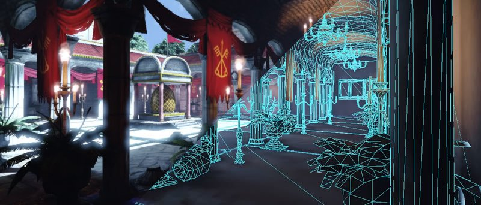

## Another level of complexity
Ok, the *please do all* function was nice and all, but the higher level the function, the less control you have over it. Let's dig deeper. For that, we'll deviser our main function in 4. The name of which will become clear along the chapter.

~~~ JavaScript
var main=function() { // Don't try to run this code!
   
  // You set up everything
  func_1_****();
  func_2_****();   
  func_3_****();

  // You play with and animate it
  func_4_****();
 
};
~~~

## 3D rendering geometry
While a human is able to do one complex task easily at one glance (locating people in a picture), the machine can only do very simple task but it does it very fast. This shows in the way graphics are rendered on screen, up to the geometric level. The scene below appears to the eye as composed of many complex objects. In modern 3D computer graphics, each of these object is usually divided in triangle shapes, the sum of it forming the object's geometry. Add to that a bit of shading and post-processing, and you get the scene as you see it.

Why using triangles? Because they are the simplest possible surface. 3 points define a surface (triangle) while two would only define a line (segment). Add one more and at best you have a quadrilateral, at worse you have some weird volumetric shape that is hard to interpret. So, if you want to use a surface to define an enclosed volume, triangles are the best building blocks. No wonder it's the lingua franca in graphic processing!

So, your geometry is based on triangles. On what is based your triangles? Well, on *dots* in space. Those *dots* have a more formal name: **vertex** (plural: **vertices**). All geometry you'll encounter is based on a set of vertices, usually read as a set of triangles. You can go simple stuff (a square -two triangles-, a cube -twelve triangles-...) and more complex and eye-appealing forms. This drawing part is what we'll do in function 3: `func_3_createTriangle();`. It'll draw one triangle. Up to you to add more in the next logs to create a complexe mesh!

## Pipeline Overview

So, now we have our triangle. How do we go from a barebone 3D mesh to a fancy textured post-processed scene? What happens next happens on the GPU itself. The set of vertices (and possiblity other associated data, such as colors, normals...) we defined as our mesh is then saved directly on the GPU, ready to be processed through a serie of steps we call the **graphic pipeline**. Every frame you see on screen is rendered through this pipeline.

1. First, the **Vertex Shader** will altere the vertices themselves (the positions in space) through translation, rotation, scaling and other shenanigans. This allows for instance to place your mesh at a specific position;
2. Then the **shape assembly** will decide how to read this list of vertices. Usually (not always) they will be read as a serie of triangle surfaces as we wrote earlier. They could other wise been seen as dots or line for instance. We'll play with that in another log;
3. Then it's time for the **rasterization**: up until now, we had coordinates in 3D. But news flash, your screen is 2D and discrete: pixel based. The rasterisation is this projection from the 3D space to your screen. It transforms shapes in set of **fragments**, temporary pixels that still have to pass several test to earn the right to be displayed;
4. Another shader: the **Fragment Shader** 

After these vertex transformations, the renderer will form triangles out of the list of vertex positions. This step can be configured to alternatively form lines or points. We will stick here to the triangle case. 

At this point we just have abstract triangles defined in an abstract coordinate system. It's time to convert that into real pixels! Or more precisely into fragment,  The job of the rasterizer is to determine which frament is contained in the triangle. 

The programmable fragment shader will run for every fragments defined in the rasterization process, allowing to choose what will be the final color of the fragment. It will depend on textures, fragment position, external parameters etc ...

The final step is to discard fragments that don't pass visibility tests. One of these test is the (optional) depht test : if one triangle is obscured by another triangle, the fragment of the closer triangle should end up on the screen. The survivors of these tests are finally called pixels. We finally got them !

## OpenGL state machine

* state machine
* openGL contexte
* expliquer principe du bind

## First look at our render library
Map each step of the rendering pipeline to a function of the library

~~~ JavaScript
var main=function() {
    
  // You set up everything
  func_1_initialisation("your_canvas");
  func_2_createShaders();    
  func_3_createTriangle();

  // You play with and animate it
  func_4_draw();
  
};
~~~
