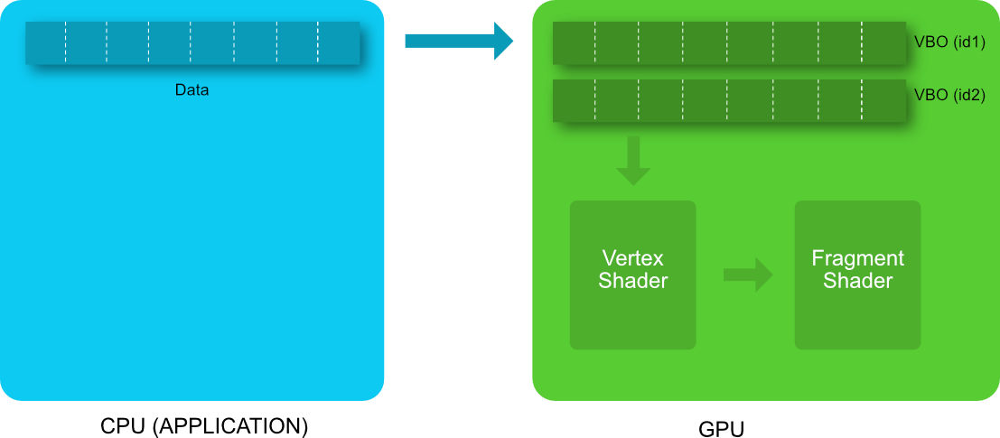

This is madness... You know how to handle your vertex, but you haven't send them yet... Let's take care of that!

## Create your own shape

Before sending the vertex to your shader, you need first to decide what they will be. Our job here is to define a set of vertex, amounting to the shape we want to describe. While we define this set in the CPU, we need it to reside in the GPU, for it to become the first step of the graphic pipeline. For that, we'll use a **Vertex Buffer Object** (VBO). A VBO is a buffer, residing in the GPU memory, and containing vertex informations. That means that you need to upload the vertex informations to the GPU just once. The vertices will stay there until the VBO is explicitly destroyed or modified by the application. 

During a frame rendering, the vertex shader reads directly the VBO, vertex per vertex, and use it as input attribute. (Ohhh now we understand where the positions are coming from in the vertex shader).

Before anything else, delete `OTSHelper_createTriangle();`, this time there won't be any in between functions! Now let's write our own code. First, we'll have to define our geometry, represented by the set of vertice named **data** in the diagram above. For that, we'll define a set of vertex, only holding their position for now. If you remember from last log, such position should be in the [-1, 1] range (when you don't play with depth).

The first thing to do is to define the vertex positions (**data** on the previous diagram) we want to send to the vertex shader. Each position has 3 coordinates : X, Y, Z. The X and Y coordinates go from -1 to 1 as shown below.

Vertices with position outside of the -[1, 1] rectangle won't appear in your webGL view. The Z axis point toward you: a vertex with negative Z coordinate will be placed *behind* your screen. 

Let's now write each vertex of one humble triangle (in the `setup()` function, where the deleted function was).

~~~ JavaScript

// define vertex positions of our first triangle
var vertexPositionArray = [
    -0.5, -0.5, 0, //bottom left
     0.5, -0.5, 0, //bottom right 
     0.5,  0.5, 0  //top right
];

// While one could easily compute the number of vertice in our shape,
// let's hardcode it here for easier later usage.
numberOfVertices = 3;
~~~

Armed with our array of vertices, we have now all we need to create our VBO on the GPU. Three steps awaits us to do so:

* first we'll need to create a webGL buffer and register its id;
* then we'll need to **bind** the buffer (discussed below);
* last, we'll send the data through the `bufferData` GL function and specify with GL.STATIC_DRAW that the we won't change the data contained in the VBO, it will be a static mesh.

So, binding... Binding is a key operation in webGL (done through the GL function` bindBuffer()`) . It's a way to make accessible one object in particular in order to modify it. When the variable is on the CPU, you can access it directly. Not so easy when it's supposed to be on the GPU, hence the binding. Here, we bind our newly created buffer, as a GL.ARRAY_BUFFER since we'll feed it an array. That's a mechanism used everywhere in OpenGL/WebGL so get used to it!

So, how do these three steps translate in code?

~~~ JavaScript

// create an empty buffer object
window.vertexBufferPositionID = GL.createBuffer ();

// bind to the new buffer object 
GL.bindBuffer(GL.ARRAY_BUFFER, vertexBufferPositionID);

// send data to the new buffer object
GL.bufferData(GL.ARRAY_BUFFER,
            new Float32Array(vertexPositionArray),
            GL.STATIC_DRAW);
~~~	

The vertices of the triangle are now loaded in the VBO and will be used by the vertex shader every time the scene is rendered.

## Ok, but why stop there?
Hell, now let's give free rein to your imagination. I mean, you can draw anything you want. Yep, it can be a tad tedious (so, how do I draw a sphere based on triangles?) but then again, you got the full power of a programming language behind you... Use random values in order to generate shapes, use a loop to create multiple of those shapes, you're free.

In our case, we'll be much more humble and draw the next best thing to a triangle: a square. It'll be useful for upcoming tasks.

~~~ JavaScript
// define vertices of a quad
var vertexPositionArray=[
    //----- triangle 1
    -0.5,-0.5,0, //bottom 
    0.5,-0.5,0, //bottom right 
    0.5,0.5,0,  //top right

	//----- triangle 2
    -0.5,0.5,0, //top left
    0.5,0.5,0, // top right
    -0.5,-0.5,0, // bottom left
];

// Since we have 2 triangles, we have now 6 vertices
numberOfVertices = 6;
~~~

## The rendering loop

We know already a bit of it. First, we have our `draw` function that will be repeatedly called, and inside, the library function. Let's delete the later, and fill directly `draw` with all the goodies! You'll see in this section a lot of "yes but no", functions with a heavy load of parametr. What you need first is to make it work. Then bit by bits, you can both play and understand the parametres. Some of them (while all described) are out of scope of this workshop.

Let's get rid of most stuff before focusing on two specific functions:

* First, we'll call `GL.useProgram` to specify we want to use our shaderProgramId;
* Then we'll define the viewPort, meaning the portion of our screen. Here we want to begin at 0 and end at the canvas's witdh and height;
* After that, we'll just reset the colors with `GL.clear(GL.COLOR_BUFFER_BIT);`

Code wise, this will be the first part of our new `draw` function (don't suppress the request animate frame part!):

~~~ Javascript
// use the shader we defined earlier
GL.useProgram(shaderProgramId);

// define the size of the view
GL.viewport(0.0, 0.0, CANVAS.width, CANVAS.height);

// clear the color buffer
GL.clear(GL.COLOR_BUFFER_BIT);
~~~

Now the harder stuffs arise. First we need to access our VBO. Any idea how? Yep, we need to bind it. Then, you remember we needed to feed our vertex shader some vertices information right? That's what we're at last doing. `getAttribLocation` will tel us where to point, and `vertexAttribPointer` will do the link. In order to do so, we need to specify first the location (the one we just got), how many component we have per vertices (3: x, y, z), how they are read (they are floating values), and ... three other stuff (normalized, stride, offset) that won't matter much for now. Just follow along!

Last function (before the `requestAnimationFrame` we already know) is the one that actually does the drawing: `drawArrays`. We need to feed it first how we will read our shape (here as `TRIANGLES`), the starting point of our array in data (here 0) and last, the number of vertice that we already defined above. And how that translate in code? Here you go, be sure to add that second part in your `draw` function.

~~~ Javascript

    // Bind our Buffer, and use it for drawing
    GL.bindBuffer(GL.ARRAY_BUFFER, vertexBufferPositionID);
    
    var positionAttibuteLocation = GL.getAttribLocation(shaderProgramID, "position");
    GL.vertexAttribPointer(positionAttibuteLocation, 3, GL.FLOAT, false,0,0) ;
    
    GL.drawArrays(GL.TRIANGLES, 0, numberOfVertices);

    window.requestAnimationFrame(draw);
};
~~~

As said in previous log, we mostly use triangles to create our geometry, but we can actually display our vertices as something else. Try to replace `GL.TRIANGLES` with `GL_LINE_LOOP` or `GL_DOTS` for instance.

## On a completly unrelated note: WebGL Init
Errr, what can we say, this part is a bore... But hey, be merry, `OTSHelper_initGL("yourcanvas");` is the last function you need to delete before we can set your code free from our library!

So, what does it implies to initialize our webGL context? First, we need to have access to our canvas HTML tag and measure it. Then we try to get a WebGL context from it, and then set the clear color to black. Which code wise means:

~~~ JavaScript

// Getting the Canvas
CANVAS = document.getElementById(canvasId);
CANVAS.width=window.innerWidth;
CANVAS.height=window.innerHeight;

// Initialising the WebGL Context
try {
	GL = CANVAS.getContext("webgl-experimental");
} catch (e) {
	alert("Your setup is not webgl compatible :(") ;
	return false;
}
    
GL.clearColor(0.0, 0.0, 0.0, 0.0);

~~~
