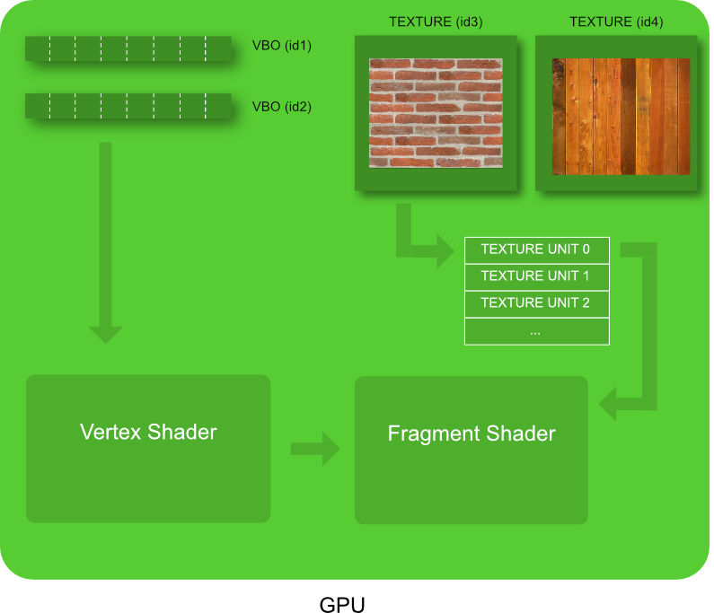

## a) How texture works

Ok it's time to drop our solid color quad and replace it by something potentially more exiting : textures. 

A texture is are memory buffer on the GPU allocated to store an image.  

~~~ html

~~~

~~~ html

~~~

(enable the attribute we added in the vertex shader)

~~~ JavaScript

// enable the attributes
GL.enableVertexAttribArray(colorAttributeLocation);
GL.enableVertexAttribArray(positionAttributeLocation);
GL.enableVertexAttribArray(texCoordAttributeLocation); // -> enable the new texture coord attribute here

~~~

(load the texture in the GPU memory)

~~~ JavaScript
function loadTexture(imageURL)
{
    // create an empty texture object on the GPU
    var textureID = GL.createTexture();

    // Asynchronously load an image
    var image = new Image();

    image.crossOrigin = "";
    image.src = imageURL;
    
    image.addEventListener('load', function() 
    {
        // bind to the new texture object
        GL.bindTexture(GL.TEXTURE_2D, textureID);

        // configure the texture object
        GL.texParameteri(GL.TEXTURE_2D, GL.TEXTURE_MAG_FILTER, GL.LINEAR);
        GL.texParameteri(GL.TEXTURE_2D, GL.TEXTURE_MIN_FILTER, GL.LINEAR);

        // send image to the texture object
        GL.texImage2D(GL.TEXTURE_2D, 0, GL.RGBA, GL.RGBA, GL.UNSIGNED_BYTE, image);

        window.texureIsLoaded = true;
    });

    return textureID;
}
~~~

(create a new VBO with texture coordinates)

~~~ JavaScript
// load the texture on the GPU
window.textureID = loadTexture("texture.jpg");

// define the texture coordinates
var textureCoordinateArray=[
    0,0, //bottom left
    1,0, //bottom right 
    1,1,  //top right

    0,1, //top left
    1,1, // top right
    0,0, // bottom left
];

// create an empty buffer object
window.vertexBufferTexCoordID = GL.createBuffer ();

// bind to the new buffer object 
GL.bindBuffer(GL.ARRAY_BUFFER, vertexBufferTexCoordID);

// send data to the new buffer object
GL.bufferData(GL.ARRAY_BUFFER,
            new Float32Array(textureCoordinateArray),
            GL.STATIC_DRAW);
~~~

(in the draw loop : glue between the vbo texture coord, and the attribute texture coord in the shader)

~~~ JavaScript
numberOfComponents = 2;
// link our vertex buffer to the shader attribute texture coordinate
GL.bindBuffer(GL.ARRAY_BUFFER, vertexBufferTexCoordID); // -> next draw will use that buffer
var positionAttibuteLocation = GL.getAttribLocation(shaderProgramID, "texureCoordinates");
GL.vertexAttribPointer(positionAttibuteLocation, numberOfComponents, GL.FLOAT, false,0,0) ;
~~~

(in the draw loop : tell the GPU to link our texture to TEXTURE_0)

~~~ JavaScript
// assign our texture object to texture unit TEXTURE_0 
GL.activeTexture(GL.TEXTURE0);
GL.bindTexture(GL.TEXTURE_2D, textureID);
~~~

## d) Using a second textures as tool
* generate a second texture
* set a second texture uniform and set the right texture unit (not needed previously because by default texuteUnit = 0)
* use the second texture as displacement map (?)

ref: https://open.gl/textures
