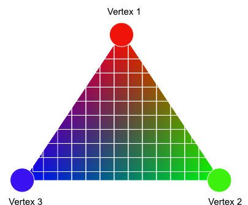

## c) Animating your shape

Now it would be interesting to change the position and the colors from our javascript code. 
Uniforms are variables of which value is constant for every vertex or fragment. 
Let's control the red color component with a uniform. In our fragment shader, we will have

~~~ html

~~~

Setting the value of a uniform is almost straightforward (at least in OpenGL standard!)

~~~ html
// update uniforms
var redColorLevel = 1.0;
var redColorUniformLocation = GL.getUniformLocation(shaderProgramID, "u_redColor");
GL.uniform1f(redColorUniformLocation,redColorLevel);
~~~

As usual, we first get the location of the variable in the shader with the function getUniformLocation. 
We update it then with the function uniform1f. 

You should obtain a beautiful pink square. 
This color change can be automated. Let's use the current time to change the color periodically. 

~~~ html
var timeSecond = new Date().getTime() / 1000;

var redColorLevel = (Math.sin(timeSecond)+1)*0.5; // -> change periodically with time
var redColorUniformLocation = GL.getUniformLocation(shaderProgramID, "u_redColor");
GL.uniform1f(redColorUniformLocation,redColorLevel);
~~~

The square now changes slowly its color from pink to blue periodically. 

A colored square is cool. But you know what's even cooler ? A rotating color square !
We will modify the square position using a matrix uniform in the vertex shader. 

~~~ html

~~~

The position (x,y,z,w) is now multiplied by a 4x4 matrix. This allow almost any kind of scale and rotation operations on the positions. What does this matrix contain? 
Let define it in our javascript code :

~~~ JavaScript
var angle = timeSecond*10;
// create a new identity matrix
var transformMatrix = new J3DIMatrix4()
// add rotation around x,y,z 
transformMatrix.rotate(angle,angle*0.3+30,0);
var transformMatrixLocation = GL.getUniformLocation(shaderProgramID, "u_transformMatrix");
// send the matrix to the vertex shader uniform 
GL.uniformMatrix4fv(transformMatrixLocation,false,transformMatrix.getAsFloat32Array());
~~~

We use the library J3DIMath here to get a matrix containing rotation around 3 axes (x,y,z). 
The uniform is then updated using the OpenGL function uniformMatrix4fv.

## d) Send additional vertex informations : colors

For the moment, the color of the triangle is hardcoded and is the same for every pixels. What if we want one color per vertex ? Let's create another VBO that will contain the colors. 

Replace your vertex shader with this code : 

~~~ html

~~~

We added an input attribute called color, and added an additional v_Color variable that will be passed to the fragment shader. Those outputs are called varying because they are interpolated between the vertices. 

Here is the fragment shader : 

~~~ html

~~~

The varying v_Color must be declared here as well. The final output will be the v_Color augmented with av alpha value. 
The new attribute must be activated, like the position attribute. Add those two lines  in your javascript code : 

~~~ JavaScript
// get attribute location
var colorAttributeLocation = GL.getAttribLocation(shaderProgramID, "color");
// enable the attribute
GL.enableVertexAttribArray(colorAttributeLocation);
~~~ 

Now let's feed that new input attribute. In the javascript code, just below the vertex position loading, add a vertex color loading. 

~~~ JavaScript

var vertexColorArray=[
    1,0,1, //bottom left
    1,1,1, //bottom right
    1,1,0, //top right
    
    0,0,1, //top left
    1,0,0, // top right
    0,1,0, // bottom left
];

// create an empty buffer object
window.vertexBufferColorID= GL.createBuffer ();

// bind to the new buffer object
GL.bindBuffer(GL.ARRAY_BUFFER, vertexBufferColorID);

// send data to the new buffer object
GL.bufferData(GL.ARRAY_BUFFER,
            new Float32Array(vertexColorArray),
            GL.STATIC_DRAW);
~~~

This works exactly like the vertex position buffer : 
* We manually define a data array with our colors (R,G,B)
* We create an empty VBO
* We fill it with our color array

We still need to link our attribute "color" to this new VBO. Let's do this in the draw function. Add this code before the GL.drawArrays call : 

~~~ JavaScript
GL.bindBuffer(GL.ARRAY_BUFFER, vertexBufferColorID);
var colorAttibuteLocation = GL.getAttribLocation(shaderProgramID, "color")
GL.vertexAttribPointer(colorAttibuteLocation, numberOfComponents, GL.FLOAT, false,0,0) ;
~~~ 

And now you should obtain a beautiful multicolor quad. Why ? We only defined color for our 6 vertices. And these colors have been interpolated for each pixel drawn in the  triangles defined by these vertices, thanks to the magic "varying" variable. 

That's a fundamental concept to understand. The fragment shader takes data produced by the vertex shader and interpolate them for each fragment.

## e) Controling this mess

* Using the mouse position (x and y) as a control for other stuff

Based on:

~~~ HTML

~~~

## d) Let's do a cube!
* triangles to cube. Simple. Nice. Good for your health
