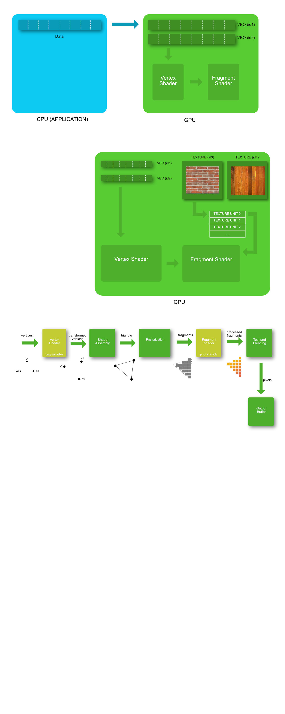
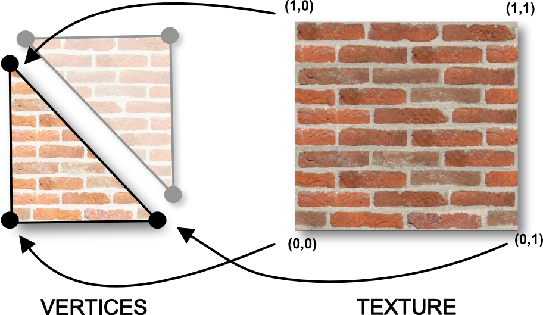

## a) How texture works

Ok, it's time to drop our solid color quad and replace it by something potentially more exiting : textures. 

Textures are basically a chunk of GPU memory usually containing image data. As we learned earlier, data transfer between CPU memory and GPU memory is really expansive performance-wise. That's why, like the VBO's, textures are typically uploaded once to the GPU and read directly from the fragment shader every frame. Textures are often the resources using most of the space in the GPU memory, so high resolution images must be used with parsimony.

Here is a diagram showing how texture memory is accessed from the shaders :

Two textures objects are represented on the top right of the diagram. For legacy reason better left unexplained, instead of using directly a reference to those texture, shaders use an intermediate index called Texture Unit, representing a texture slot. So, using a texture in a shader is done in 2 steps : 

* Associate a texture to a Texture Unit
* Tell the shader which Texture Unit it will use

Choosing the texture we want to display is a good thing. But how to map that texture on a mesh that can be literally anything ( a triangle, a sphere, a dolphin ...) ? With a tool you already know : the VBO. Exactly like we added a color information VBO earlier, we will define a new Texture Coordinate VBO. For each vertex we will define a corresponding position in the texture :

As you can see each vertex is associated with a position in the texture.  Here is the vertex shader reading that new Texture Coordinates as an input attribute :

~~~ html

~~~

As you can see, the Texture Coordinate is passed as a varying to the fragment shader. And just like the color varying, it will be magically interpolated in the fragment shader. As a result, the fragment in the middle of the two vertices of the bottom in the previous diagram will receive a texture coordinate equal to (0.5,0). Which is exactly what we want !

Here is the fragment shader : 

~~~ html

~~~

The fragment shader access the texture via a *sampler2D*, which is the index representing the texture unit we want to use. It's a uniform, so it can be set later in our javascript code. The function texture2D(...) is where the magic happens : you get the color of the texture at the coordinate you received from the varying. 

Now let's go back to our javascript code. The first thing to do when you defined a new attribute ? Enable it ! Add these lines just after the activation of the two other attribute, in the main function. 

~~~ JavaScript

var normalAttributeLocation = GL.getAttribLocation(shaderProgramID, "normal");
GL.enableVertexAttribArray(normalAttributeLocation); // -> enable the new texture coord attribute here

~~~

Second thing to do is to load a texture on the GPU. Let's write a generic javascript function that receives an image url, opens it, and creates a texture on the GPU. You can place this code under the draw function :  

~~~ JavaScript
function loadTexture(imageURL)
{
    // create an empty texture object on the GPU
    var textureID = GL.createTexture();

    // Asynchronously load an image
    var image = new Image();

    // allows the image to be loaded from a cross site
    image.crossOrigin = "";
    image.src = imageURL;
    
    // when the image will be loaded .... call this code
    image.addEventListener('load', function() 
    {
        // bind to the new texture object
        GL.bindTexture(GL.TEXTURE_2D, textureID);

        // configure the texture object
        GL.texParameteri(GL.TEXTURE_2D, GL.TEXTURE_MAG_FILTER, GL.LINEAR);
        GL.texParameteri(GL.TEXTURE_2D, GL.TEXTURE_MIN_FILTER, GL.LINEAR);

        // send image to the texture object
        GL.texImage2D(GL.TEXTURE_2D, 0, GL.RGBA, GL.RGBA, GL.UNSIGNED_BYTE, image);

        window.texureIsLoaded = true;
    });

    return textureID;
}
~~~

As you can see the javascript image loading is done asynchronously. So we need to define a function listener that will be called when the loading is over. 

Like every other buffer creation (you should now get used to!), we follow the usual steps:
 
* we create an empty texture object with GL.createTexture()
* we bind the new empty object
* we upload the data to it with the GL.texImage2D function

One additional thing is the configuration of the texture : as the pixel displayed on your screen won't match exactly the pixels of the texture, it's mandatory to define what interpolation to use between pixels. The mode GL.LINEAR will return the weighted average of the 4 pixels surrounding the given coordinates. That's perfect for us! This parameter must be set when the displayed image is bigger than the original image (TEXTURE_MAG_FILTER), and when the displayed image is smaller than the original image (TEXTURE_MIN_FILTER).

Don't forget to actually call that new function from your main function : 

~~~ JavaScript

// load the texture on the GPU
textureID = loadTexture("https://opentechschool-brussels.github.io/intro-to-webGL-and-shaders/src/texture.jpg");

~~~

Always in the main function code, we can now send the texture coordinates to a brand new VBO : 

~~~ JavaScript
// define the texture coordinates
var textureCoordinateArray=[
    0,0, //bottom left
    1,0, //bottom right 
    1,1,  //top right

    0,1, //top left
    1,1, // top right
    0,0, // bottom left
];

// create an empty buffer object
window.vertexBufferTexCoordID = GL.createBuffer ();

// bind to the new buffer object 
GL.bindBuffer(GL.ARRAY_BUFFER, vertexBufferTexCoordID);

// send data to the new buffer object
GL.bufferData(GL.ARRAY_BUFFER,
            new Float32Array(textureCoordinateArray),
            GL.STATIC_DRAW);
~~~

We define for each vertex, in the same order than the two other VBO's (position and color) the corresponding texture coordinate. As you can see texture coordinates use the coordinate system [0:1] with the origin centered on the a bottom left. 

In the draw function, let's glue our new Texture Coordinate VBO with our input attribute we defined earlier in the vertex shader. You shouldn't be surprised, it works exactly like the two other VBOS's : 

~~~ JavaScript
numberOfComponents = 2;
// link our vertex buffer to the shader attribute texture coordinate
GL.bindBuffer(GL.ARRAY_BUFFER, vertexBufferTexCoordID); // -> next draw will use that buffer
var positionAttibuteLocation = GL.getAttribLocation(shaderProgramID, "texureCoordinates");
GL.vertexAttribPointer(positionAttibuteLocation, numberOfComponents, GL.FLOAT, false,0,0) ;
~~~

Always in the draw loop, we tell openGL that our texture must be linked to the texture unit TEXTURE_0

~~~ JavaScript
// assign our texture object to texture unit TEXTURE_0 
GL.activeTexture(GL.TEXTURE0);
GL.bindTexture(GL.TEXTURE_2D, textureID);
~~~

Finally set our sampler uniform to TEXTURE_0 :

~~~ JavaScript
var textureSamplerLocation = GL.getUniformLocation(shaderProgramID, "texture");
GL.uniform1i(textureSamplerLocation, 0);
~~~

At this point, finally, you should see a texture appearing on your quad. YES!

